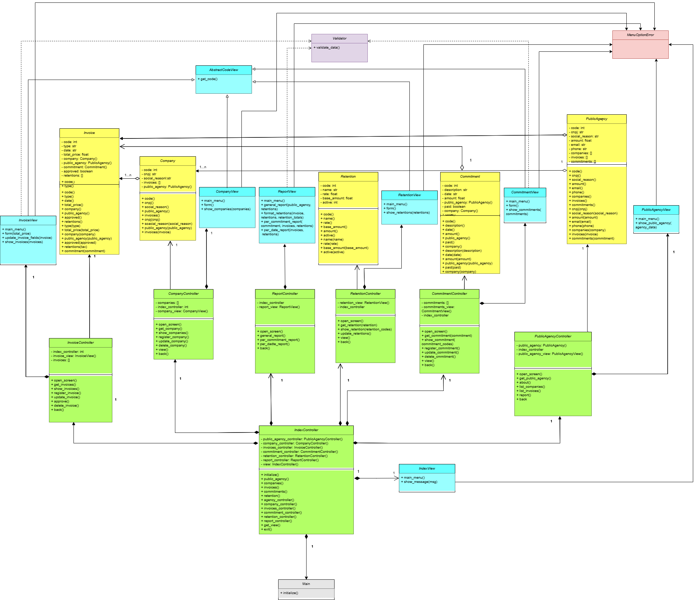

# Sistema de Controle de Retenção de Tributos - Órgão Público

Este sistema, desenvolvido em Python com base no paradigma de programação orientada a objetos, tem como objetivo organizar e controlar os dados de pagamento de tributos (taxas, contribuições, impostos) que devem ser deduzidos durante o processo de pagamento de despesas de um órgão público, permitindo o controle **off-line** antes do lançamento no sistema da Receita Federal (e-CAC).

## Estrutura do Sistema

O sistema segue uma abordagem **orientada a objetos**, com as seguintes entidades principais:

- `Usuario`: operador ou homologador que interage com o sistema
- `Empresa`: empresa fornecedora
- `DocumentoFiscal`: nota fiscal ou fatura emitida pela empresa
- `Empenho`: valor reservado para a despesa
- `Retencao`: valor que será deduzido de tributos
- `Pagamento`: consolida todas as informações e processa o pagamento

## Conceitos de Orientação a Objetos Aplicados

- **Encapsulamento**: as classes possuem atributos privados e métodos públicos para manipulação de dados
- **Associação**: 
  - `Pagamento` está associado a um `Empenho`
- **Agregação**: 
  - `Empresa` agrega vários `DocumentoFiscal` que podem existir independentemente
- **Composição**: 
  - `Pagamento` compõe uma `Retencao`, que só existe junto com o pagamento

  

